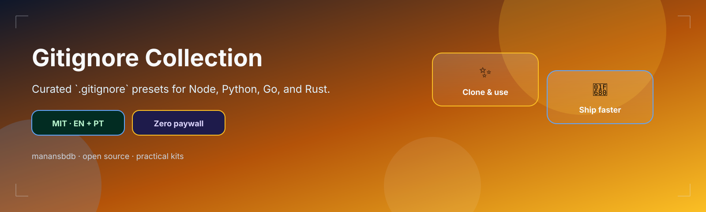

<p align="center">
  
</p>

<h1 align="center">gitignore-collection</h1>

<p align="center">
  <strong>EN</strong> Curated .gitignore files for Node, Python, Go, and Rust<br/>
  <strong>PT</strong> Ficheiros .gitignore curados para Node, Python, Go e Rust
</p>

<p align="center">
  <a href="https://github.com/manansbdb/gitignore-collection/blob/main/LICENSE"></a>
  
  
  <a href="#support--apoio"></a>
</p>

---

## What it does / Para que serve

| English | Português |
|---------|-----------|
| A small collection of **language `.gitignore`** templates (Node, Python, Go, Rust). | Uma coleção pequena de templates **`.gitignore`** (Node, Python, Go, Rust). |
| Copy the matching file to your repo root as `.gitignore`. | Copia o ficheiro certo para a raiz do repo como `.gitignore`. |


---

## Install / Instalação

### 1) Clone / Clona

```bash
git clone https://github.com/manansbdb/gitignore-collection.git
cd gitignore-collection
```

### 2) Apply / Aplica

```bash
# example: Node
cp gitignore/Node.gitignore /path/to/your-project/.gitignore
# Python → gitignore/Python.gitignore
# Go     → gitignore/Go.gitignore
# Rust   → gitignore/Rust.gitignore
```

### Requirements / Requisitos

- `git`
- No runtime dependencies

---

## Quick start / Início rápido

```bash
git clone https://github.com/manansbdb/gitignore-collection.git
cp gitignore-collection/gitignore/Node.gitignore ./.gitignore
```

---

## Contents / Conteúdos

| Path | Purpose / Função |
|------|------------------|
| `gitignore/Node.gitignore` | Node.js ignores |
| `gitignore/Python.gitignore` | Python ignores |
| `gitignore/Go.gitignore` | Go ignores |
| `gitignore/Rust.gitignore` | Rust ignores |
| `SUPPORT.md` | Donations / Doações |

---

## Project layout / Estrutura

```text
gitignore-collection/
├── docs/banner.svg
├── gitignore/Node.gitignore
├── gitignore/Python.gitignore
├── gitignore/Go.gitignore
├── gitignore/Rust.gitignore
├── SUPPORT.md
└── README.md
```

---

## Support / Apoio

Bitcoin donations welcome / Doações em Bitcoin bem-vindas:

```
bc1q0qfnlnxyum9u45stzxe0a7jnhtj4j0usfkqdjw
```

See [SUPPORT.md](./SUPPORT.md).

---

## License / Licença

[MIT](./LICENSE) © 2026 manansbdb
